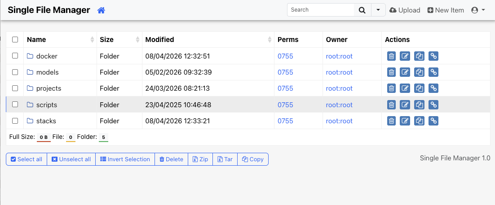
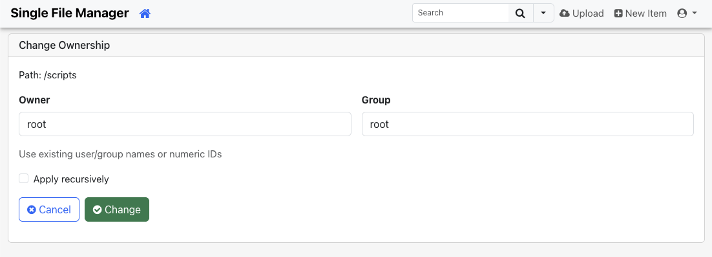
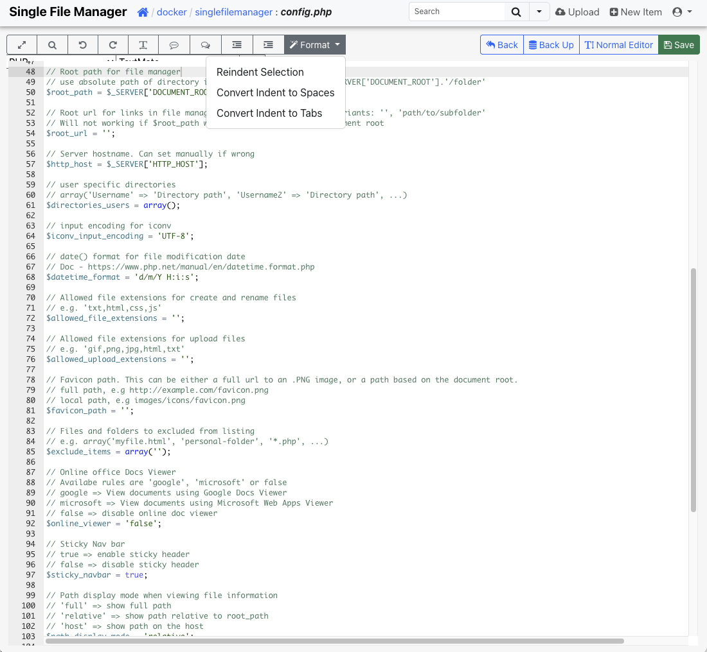

# Single File Manager

> Single File Manager is an independently maintained GPL-3.0 fork of [Tiny File Manager](https://github.com/prasathmani/tinyfilemanager). It keeps the original lightweight single-file PHP approach while extending authentication, editor capabilities, and security hardening for self-hosted deployments.

Single File Manager is a web-based PHP file manager designed for simplicity and efficiency. It can be dropped into an existing server directory to upload, edit, preview, move, copy, archive, and manage files directly from the browser.

Project repository: [alceasan/singlefilemanager](https://github.com/alceasan/singlefilemanager)

<sub>**Caution!** _Avoid utilizing this script as a standard file manager in public spaces. It is imperative to remove this script from the server after completing any tasks._</sub>

## Documentation

The original Tiny File Manager project is documented on the [upstream wiki](https://github.com/prasathmani/tinyfilemanager/wiki). This fork keeps the same overall structure, but adds fork-specific authentication and editor features documented in this repository.

## Screenshots

Main file listing:



Change ownership dialog:



Advanced editor:



## Requirements

- PHP 5.5.0 or higher.
- Fileinfo, iconv, zip, tar and mbstring extensions are strongly recommended.

## How to use

Download the latest release ZIP from the default branch or a tagged release.

Just copy `simplefilemanager.php` to your webspace and load it from the browser.
If you use the Docker image, the file is still served internally as `index.php`.

Default username/password: **admin/admin@123** and **user/12345**.

:warning: Warning: Please set your own username and password in `$auth_users` before use. Passwords are encrypted with <code>password_hash()</code>. To generate a new password hash, use the built-in helper in the app or your preferred PHP tooling.

To enable/disable authentication set `$use_auth` to true or false.

:information_source: A versioned example is included as `config.sample.php`. Copy it to `config.php` in the same folder and adapt it for your deployment.

:information_source: Authentication can be configured with `$auth_method`:

- `$auth_method = 'password';` keeps the classic local username/password login using `$auth_users`. This is the default and legacy behavior.
- `$auth_method = 'trusted_header';` reads the authenticated username from a trusted web server or reverse proxy header.
- `$auth_method = 'oidc';` uses OpenID Connect directly from Single File Manager with authorization code flow + PKCE.

When using `trusted_header`, the header name is configured with `$auth_trusted_header` and defaults to `Remote-User`.
You can optionally restrict access to an exact allow-list of usernames with `$auth_trusted_header_users`.
If `$auth_trusted_header_users` is empty, any trusted header user is allowed.

Example `config.php` for the classic login:

```php
<?php
$use_auth = true;
$auth_method = 'password';
```

Example `config.php` for trusted header login:

```php
<?php
$use_auth = true;
$auth_method = 'trusted_header';
$auth_trusted_header = 'Remote-User';
```

Example `config.php` for trusted header login restricted to specific users:

```php
<?php
$use_auth = true;
$auth_method = 'trusted_header';
$auth_trusted_header = 'Remote-User';
$auth_trusted_header_users = array('alice', 'bob');
```

Example `config.php` for OpenID Connect:

```php
<?php
$use_auth = true;
$auth_method = 'oidc';
$oidc_issuer = 'https://sso.example.com/application/o/singlefilemanager/';
$oidc_client_id = 'singlefilemanager';
$oidc_client_secret = 'replace-me';
$oidc_redirect_uri = 'https://files.example.com/index.php?oidc=callback';
$oidc_post_logout_redirect_uri = 'https://files.example.com/index.php?oidc=logged_out';
```

Optional OIDC authorization controls:

- `$oidc_username_claim` defaults to `preferred_username`
- `$oidc_group_claim` defaults to `groups`
- `$oidc_allowed_users` restricts access to exact usernames
- `$oidc_allowed_groups` restricts access to matching groups
- if both `$oidc_allowed_users` and `$oidc_allowed_groups` are empty, any authenticated OIDC user is allowed
- if either list matches, access is allowed

If `$oidc_redirect_uri` is empty, Single File Manager uses the current script URL with `?oidc=callback` as the callback URL.
In many deployments that means `https://files.example.com/index.php?oidc=callback`, not `https://files.example.com/?oidc=callback`.
If your provider uses strict redirect URI validation, register the exact callback URL and set `$oidc_redirect_uri` explicitly to the same value.

If `$oidc_post_logout_redirect_uri` is empty, Single File Manager uses the current script URL with `?oidc=logged_out`.
In many deployments that means `https://files.example.com/index.php?oidc=logged_out`.
When the provider publishes `end_session_endpoint`, the Sign Out menu uses it and redirects back to `$oidc_post_logout_redirect_uri`.
If the provider does not publish a logout endpoint, Single File Manager still clears the local session and redirects to the local signed-out page to avoid an immediate login loop.

:information_source: To work offline without CDN resources, you can vendor the external assets locally or adapt the CDN definitions in the PHP file.

### :loudspeaker: Features

- :cd: **Open Source:** Lightweight, minimalist, and extremely simple to set up.
- :iphone: **Mobile Friendly:** Optimized for touch devices and mobile viewing.
- :information_source: **Core Features:** Easily create, delete, modify, view, download, copy, and move files.
- :arrow_double_up: **Advanced Upload Options:** Ajax-powered uploads with drag-and-drop support, URL imports, and multi-file uploads with extension filtering.
- :file_folder: **Folder & File Management:** Create and organize folders and files effortlessly.
- :gift: **Compression Tools:** Compress and extract files in `zip` and `tar` formats.
- :sunglasses: **User Permissions:** User-specific root folder mapping and session-based access control.
- :floppy_disk: **Direct URLs:** Easily copy direct URLs for files.
- :pencil2: **Code Editor:** Includes Ace editor with syntax highlighting for 150+ languages and 35+ themes.
- :page_facing_up: **Document Preview:** Google/Microsoft document viewer for PDF/DOC/XLS/PPT, supporting previews up to 25 MB.
- :zap: **Security Features:** Backup capabilities, IP blacklisting, and whitelisting.
- :mag_right: **Search Functionality:** Use `datatable.js` for fast file search and filtering.
- :file_folder: **Customizable Listings:** Exclude specific folders and files from directory views.
- :globe_with_meridians: **Multi-language Support:** Translations available in 35+ languages with `translation.json`.
- :bangbang: **And Much More!**

### Deploy by Docker

The GitHub Actions workflow publishes multi-architecture container images for:

- `linux/amd64`
- `linux/arm64`

Published image names:

- GHCR: `ghcr.io/alceasan/singlefilemanager`
- Docker Hub: `alceasan/singlefilemanager`

Typical tags:

- `latest` for the default branch
- `1.0`, `1.1`, `2.0` for release tags such as `v1.0.0`
- `1.0`, `1` for additional semver aliases on stable releases
- `sha-<commit>` for commit-based builds

Pull examples:

```bash
docker pull ghcr.io/alceasan/singlefilemanager:latest
docker pull alceasan/singlefilemanager:latest
```

Run example:

```bash
cp config.sample.php config.php

docker run -d \
  --name singlefilemanager \
  -p 8000:80 \
  -v /data:/var/www/html/data \
  -v "$(pwd)/config.php:/var/www/html/config.php" \
  --restart unless-stopped \
  ghcr.io/alceasan/singlefilemanager:latest
```

Mounting `config.php` from the host is the recommended way to keep authentication, OIDC, path, and UI settings across redeploys or image upgrades.

Compose example:

```yaml
services:
  singlefilemanager:
    image: ghcr.io/alceasan/singlefilemanager:latest
    container_name: singlefilemanager
    ports:
      - "8000:80"
    volumes:
      - /data:/var/www/html/data
      - ./config.php:/var/www/html/config.php
    restart: unless-stopped
```

Create `config.php` from `config.sample.php` before starting the container if you want the configuration to survive redeploys.

If you prefer Docker Hub, replace the image reference with `alceasan/singlefilemanager:latest`.

### <a name=license></a>License, Credit

- Available under the [GNU GPL-3.0 license](LICENSE)
- Single File Manager is a fork of [Tiny File Manager](https://github.com/prasathmani/tinyfilemanager)
- Original concept and development by [alexantr/filemanager](https://github.com/alexantr/filemanager)
- Original Tiny File Manager maintenance and releases by [PRAŚATH MANİ / CCP Programmers](https://github.com/prasathmani/tinyfilemanager)
- CDN Used - _jQuery, Bootstrap, Font Awesome, Highlight js, ace js, DropZone js, and DataTable js_
- For upstream documentation and historical context, see the [Tiny File Manager wiki](https://github.com/prasathmani/tinyfilemanager/wiki)
